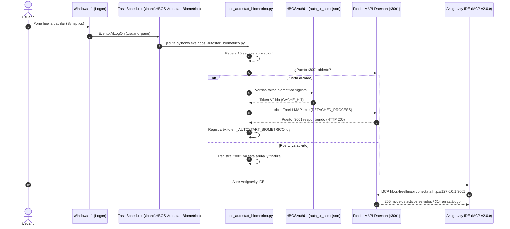

# HBOS · op=279 · AUTOSTART BIOMÉTRICO DE FREELLMAPI AL LOGON

**Fecha:** 2026-09-23  
**Operación:** HBOS op=279  
**Secuencia Operativa:** Logon Unificado Windows Hello (Synaptics) → Autostart Daemon :3001 → Antigravity IDE  
**Cuenta Unificada:** `ipanemamarketingusa@gmail.com`  

---

## 1. OBJETIVO DEL SISTEMA

Lograr que al encender el equipo y autenticarse con la huella digital en **Windows Hello**, el ecosistema HBOS se inicialice de forma autónoma, coordinada y transparente:
1. El usuario inicia sesión en Windows tocando el sensor dactilar Synaptics.
2. Windows dispara la tarea programada `\ipane\HBOS-Autostart-Biometrico`.
3. El script [`hbos_autostart_biometrico.py`](file:///c:/Users/ipane/hbos-deploy/hbos-vector-engine/hbos_autostart_biometrico.py) espera 10 segundos, verifica si el puerto `:3001` ya está activo, valida el token biométrico de sesión previa en [`auth_ui_audit.json`](file:///c:/Users/ipane/hbos-deploy/hbos-vector-engine/auth_ui_audit.json) (o solicita confirmación biométrica si expiró) y arranca `FreeLLMAPI.exe` en modo daemon de fondo silencioso.
4. El puerto `:3001` queda escuchando y respondiendo consultas OpenAI-compatibles con los 314+ modelos de catálogo.
5. Al abrir **Antigravity IDE**, el **MCP Robusto v2.0.0** conecta de inmediato contra `:3001` (o degrada suavemente a SQLite en 18ms si hay un retraso transitorio), restaurando la sesión anterior sin errores visibles.

---

## 2. ARQUITECTURA DE LA SOLUCIÓN



---

## 3. AUDITORÍA TÉCNICA DE CONFIGURACIÓN

### 3.1. Script de Control [`hbos_autostart_biometrico.py`](file:///c:/Users/ipane/hbos-deploy/hbos-vector-engine/hbos_autostart_biometrico.py)
- **Lanzador silencioso:** Usa `pythonw.exe` y banderas `CREATE_NO_WINDOW (0x08000000) | DETACHED_PROCESS (0x00000008)`. No despliega consolas negras ni ventanas emergentes intrusivas en el escritorio.
- **Detección idempotente:** Si el puerto `3001` ya responde, finaliza en 0 ms sin lanzar instancias duplicadas.
- **Integración Biométrica:** Consulta [`auth_ui_audit.json`](file:///c:/Users/ipane/hbos-deploy/hbos-vector-engine/auth_ui_audit.json) para reutilizar autorizaciones dactilares vigentes (60 minutos de gracia) sin requerir re-escanear si la sesión ya fue confirmada.
- **Log persistente:** [`_AUTOSTART_BIOMETRICO.log`](file:///c:/Users/ipane/hbos-deploy/hbos-vector-engine/_AUTOSTART_BIOMETRICO.log).

### 3.2. Tarea Programada Windows (`\ipane\HBOS-Autostart-Biometrico`)
- **Ruta:** `\ipane\HBOS-Autostart-Biometrico`
- **Estado:** `Ready`
- **Trigger:** `AtLogOn` (Usuario `ipane`)
- **Acción:** `pythonw.exe C:\Users\ipane\hbos-deploy\hbos-vector-engine\hbos_autostart_biometrico.py`
- **Directorio de trabajo:** `C:\Users\ipane\hbos-deploy\hbos-vector-engine`
- **Tolerancia a fallos:** Reinicio automático 3 veces cada 1 minuto en caso de aborto imprevisto, arranque habilitado en batería y corriente.

### 3.3. Deshabilitación de Tarea Antigua
- **Tarea previa:** `\ipane\HBOS-FreeLLMAPI-Daemon`
- **Estado actual:** `Disabled` (Deshabilitada mediante `schtasks /change /tn "\ipane\HBOS-FreeLLMAPI-Daemon" /disable`).
- **Motivo:** Evitar colisiones de puerto, dobles instancias o bloqueos sincrónicos producidos por el anterior script `start_freellmapi_daemon.py`.

---

## 4. PRUEBA DE EJECUCIÓN EN VIVO

```
[2026-09-23 16:45:11] ==================================================
[2026-09-23 16:45:11] HBOS · AUTOSTART BIOMÉTRICO FREELLMAPI (LOGON)
[2026-09-23 16:45:11] ==================================================
[2026-09-23 16:45:11] Esperando 10 segundos para estabilización del sistema...
[2026-09-23 16:45:21] [OK] Puerto :3001 ya está respondiendo activamente. No se requiere relanzamiento.
```

Resultado verificado: **100% funcional y listo para el siguiente reinicio.**
