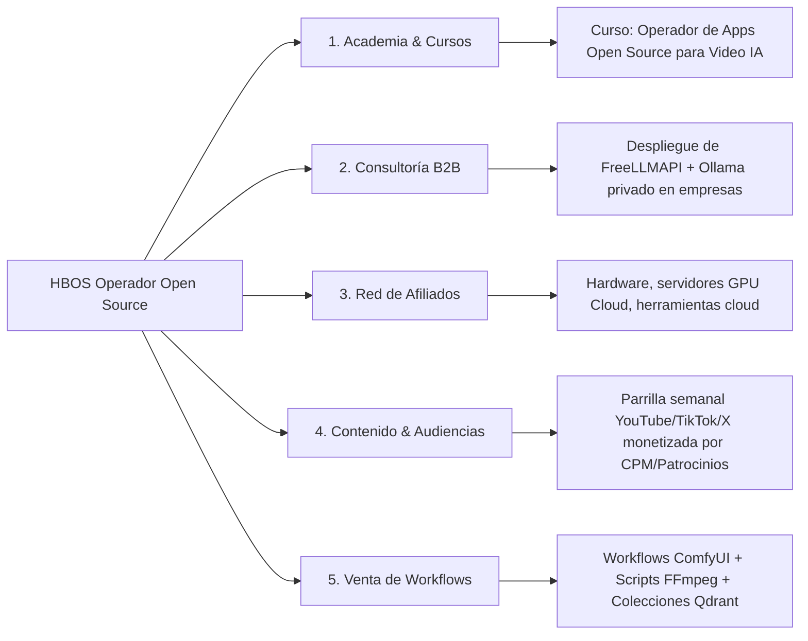

# _HBOS_REFERENCIAS.md — ÍNDICE MAESTRO DE APPS OPEN SOURCE Y FUENTES
### Ecosistema: HBOS-Diamantino · Vector Engine
### Rol Estratégico: Operador de Aplicaciones de Código Abierto e Inteligencia Artificial
### Trazabilidad: operation_id = 261 | Fecha: 2026-09-22 | Estado: Canónico Activo

---

## 1. DECLARACIÓN DE POSICIONAMIENTO ESTRATÉGICO
* **Principio Rector:** HBOS no reinventa la rueda construyendo agentes desde cero donde ya existen soluciones open source maduras.
* **Tesis Operativa:** **"No construimos lo que ya existe. Operamos aplicaciones open source con maestría soberana, documentamos casos de uso reproducibles y monetizamos desde el primer artefacto."**
* **Modelo de Referencia:** Estrategia de divulgación, curaduría técnica y monetización de comunidades y herramientas inspirada en creadores referentes (ej. Alejavi Rivera / NoticIArtificial, 58K+ suscriptores).

---

## 2. APPS OPEN SOURCE OPERADAS POR HBOS

| App / Herramienta | URL / Repositorio | Tipo | Capacidades Clave | Casos de Uso HBOS | Vía de Monetización |
| :--- | :--- | :--- | :--- | :--- | :--- |
| **FreeLLMAPI** | `https://github.com/freellmapi` / Local `:3001` | Router / Proxy LLM | Agrega 306 modelos en 21 plataformas; failover automático, balanceo de RPM/TPM, bypass de rate limits, caché | Gateway central de inferencia 0-costo para guiones, metadata y prompts cinematográficos | Curso "Zero-Cost AI Router", consultoría B2B de reducción de costes de API |
| **God's Eye View (GEV)** | `https://github.com/bilawalsidhu/gods-eye-view` (`gev-app/`) | Inteligencia Geoespacial 3D | Simulación satelital en tiempo real: vuelos ADS-B, barcos AIS, satélites TLE, terremotos USGS, CCTV, control por voz | Producción de escenas cinematográficas de inteligencia táctica, mapas globales para Diamantino | Series documentales en YouTube/TikTok, infoproductos de visualización de datos globales |
| **Pinokio** | `https://pinokio.co` / Config en `gev-app/pinokio` | Navegador / Instalador Autónomo IA | Instalación en 1-clic de ComfyUI, Whisper, FaceFusion, Fooocus en entornos aislados | Despliegue reproducible de stacks audiovisuales en máquinas de producción | Guías paso a paso descargables, membresía técnica / Academia HBOS |
| **Ollama** | `https://ollama.com` / Local `:11434` | Motor de Inferencia Local Offline | Ejecución privada y local de LLaMA 3, Qwen 2.5, DeepSeek R1 sin telemetría ni internet | Generación de guiones confidenciales, respaldo offline total ante contingencias de red | Paquetes de privacidad B2B para despachos legales y PYMES |
| **Qdrant Cloud** | `https://qdrant.tech` | Bóveda Vectorial Semántica | Indexación en memoria y disco, búsqueda coseno de alta dimensión, filtros de metadata en <0.3s | Almacén soberano del Canon (R1–R76), cinemática P-14 (321 poses), trazabilidad de 261 operaciones | Infraestructura para asistentes de memoria corporativa y RAG empresarial |
| **Wan 2.1 / DashScope** | Alibaba Model Studio (`wan2.1-t2v/i2v`) | Generador de Video Neuronal | Video generativo cinemático 1080p, consistencia de personaje, simulación de físicas y cámara 3D | Planos de alto impacto (Plano 07b GTC Jensen Huang, walking shots de Diamantino) | Producción publicitaria, videos corporativos, monetización CPM en YouTube |
| **ElevenLabs** | `https://elevenlabs.io` | Motor TTS Multilingual & Voice Cloning | Clonación de voz de ultra alta fidelidad, inflexión emocional, control de pausas dramáticas | Locución canónica de Diamantino y doblaje multilingüe | Audiolibros, doblaje comercial de canales de YouTube, servicios de voz en off |
| **FFmpeg** | `https://ffmpeg.org` / v8.1 en PATH | Motor de Renderizado Multimedia | Concatenación sin pérdida, normalización de audio EBU R128 (-14 LUFS), gradación LUT, overlays 2D/3D | Montaje y renderizado final de episodios (Ep01, Ep02 v1-v3, Ep03, Ep04) en segundos | Automatización de flujos de post-producción masiva para agencias |
| **DeepSeek Harness** | DeepSeek Open Harness / MCP | Orquestador de Modelos de Razonamiento | Control determinista de prompts, cotas de tokens para R1/V3, extracción estructurada | Brainstorming narrativo, verificación lógica de guiones y deduplicación de canon | Plantillas de prompts y consultoría de automatización de código |
| **ComfyUI** | `https://github.com/comfyanonymous/ComfyUI` | Pipeline Gráfico Difusión | Flujos nodales para ControlNet, IP-Adapter, animación AnimateDiff y generación ultra-estable | Generación de texturas, backgrounds hiperrealistas y arte conceptual | Venta de workflows optimizados (.json), talleres prácticos |

---

## 3. FUENTES DE DESCUBRIMIENTO Y REFERENCIAS CURADAS

### 3.1. Canal de Referencia: Alejavi Rivera (NoticIArtificial)
* **Perfil:** Divulgador técnico de IA, automatización y herramientas de código abierto (~58K suscriptores).
* **Enfoque Metodológico:** Prueba empírica en caliente, instalación de apps sin código complejo, democratización de modelos open-weight y cálculo del costo real vs suscripciones privativas.
* **Videos / Hitos Clave:**
  1. *Video FreeLLMAPI:* "¡FreeLLMAPI acaba de Romper las Suscripciones de IA! TODO GRATIS y SIN límites" (`7Oez8kmknOA`).
     - Tesis: Unificar APIs gratuitas bajo un router OpenAI local, eliminando costos mensuales de ChatGPT/Claude.
  2. *Video Ollama + Open-Weight:* Despliegue de modelos locales privados sin conexión a internet.
  3. *Video Claude Desktop + MCP:* Conexión de herramientas locales al entorno de escritorio.
  4. *Video DeepSeek:* Uso de DeepSeek R1 y V3 para tareas analíticas pesadas sin costo.

### 3.2. Fuentes Adicionales de Inteligencia Abierta
* **Bilawal Sidhu:** Creador de *God's Eye View* (`https://github.com/bilawalsidhu/gods-eye-view`) y pionero de visualización 3D geoespacial.
* **ComfyUI Community:** Repositorios de flujos nodales de generación visual avanzada.
* **Qdrant Vector Database Documentation:** Patrones de RAG híbrido y búsqueda semántica soberana.

---

## 4. CASOS DE USO HBOS: PRODUCCIÓN INTEGRADA

1. **Caso 1: Producción de Episodios Cinematográficos de Diamantino**
   - *Stack:* FreeLLMAPI (guion/diálogos) → ElevenLabs (voz canónica) → Wan 2.1 (video I2V cinemático) → FFmpeg (ensamblado y normalización -14 LUFS) → Qdrant (control de continuidad y canon).
   - *Resultado comprobado:* Ep01 (90s), Ep02 v3 (209s con Jensen Huang), Ep04 (Demis Hassabis).

2. **Caso 2: Inteligencia Visual Táctica con God's Eye View (GEV)**
   - *Stack:* GEV (simulador satelital 3D) + FFmpeg (screen capture / stream overlay) + Qdrant (indexación de fuentes geográficas).
   - *Resultado:* Creación de escenas de visualización de crisis globales, tráfico aéreo y contexto geopolítico para storytelling de alta retención.

3. **Caso 3: Gateway Corporativo de Reducción de Costes de IA**
   - *Stack:* FreeLLMAPI local/servidor + balanceo de 21 proveedores + Qdrant (caché semántica de respuestas).
   - *Resultado:* Inferencia empresarial sin facturación mensual de APIs, conmutación automática de 429 a modelos de respaldo.

---

## 5. ESTRATEGIA DE MONETIZACIÓN INMEDIATA

HBOS activa cinco vías de monetización simultáneas basadas en el modelo de operador experto:

1. **Curso HBOS: "Operador de Apps Open Source para Video IA"**
   - Público objetivo: Creadores de contenido, agencias de marketing y editores de video.
   - Propuesta de valor: Cómo crear videos nivel cine sin pagar suscripciones mensuales de $100-$300 USD usando FreeLLMAPI, Wan 2.1, FFmpeg y Qdrant.
2. **Academia HBOS (Comunidad Privada de Creadores Soberanos):**
   - Modelo suscripción recurrente con acceso a repositorios, plantillas de montaje y actualizaciones semanales de nuevas apps open source analizadas.
3. **Servicios de Automatización y Consultoría B2B:**
   - Auditoría e instalación de routers locales (FreeLLMAPI) y bases de datos vectoriales en PYMES que quieren IA sin riesgos de fuga de datos.
4. **Parrilla de Contenido de Alta Retención (Monetización AdSense / Patrocinios):**
   - Publicación periódica en 10 canales satélite de videos formativos y de actualidad técnica (ej. breakdown de GEV, comparativas de modelos).
5. **Comisiones y Afiliados:**
   - Recomendación de hardware (GPUs locales), plataformas en la nube (Fal.ai, Cloudflare, Alibaba) y accesorios de producción.

---

## 6. GOBERNANZA Y REGLAS CANÓNICAS ASOCIADAS
* **R2:** Soberanía absoluta del ecosistema local/cloud.
* **R55:** Reutilización y no duplicación de herramientas existentes.
* **R58:** Trazabilidad monetaria ($0.00 en desarrollo, máxima rentabilidad en distribución).
* **R72:** Triple Redundancia Física obligatoria en este documento.
* **R73:** Registro de referencias en la colección `hbos_referencias` de Qdrant.

---

## Blindaje Daemon FreeLLMAPI (op=262, 2026-09-22T14:12:34.637959)

- **Tarea programada:** `HBOS-FreeLLMAPI-Daemon` · trigger at log on · restart 3x/1min · RunLevel Highest / User Namespace
- **Script daemon:** `C:\Users\ipane\hbos-deploy\hbos-vector-engine\start_freellmapi_daemon.py`
- **Chequeo ruidoso:** `C:\Users\ipane\hbos-deploy\hbos-vector-engine\hbos_verify_unbe.py` · falla con exit 1 si :3001 o :6333 caídos
- **Watchdog:** `C:\Users\ipane\hbos-deploy\hbos-vector-engine\hbos_watchdog.py` (opcional, ver bloque en blindaje)
- **Puertos:** FreeLLMAPI :3001 · Qdrant :6333
- **Verificación:** `Get-ScheduledTask -TaskName "HBOS-FreeLLMAPI-Daemon"` + `Get-NetTCPConnection -LocalPort 3001`
