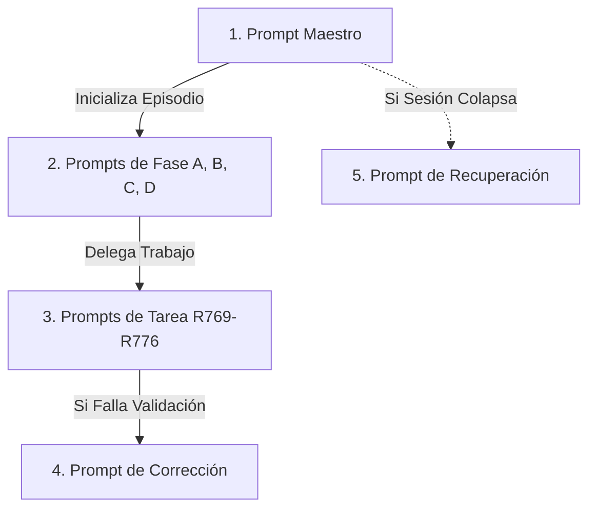
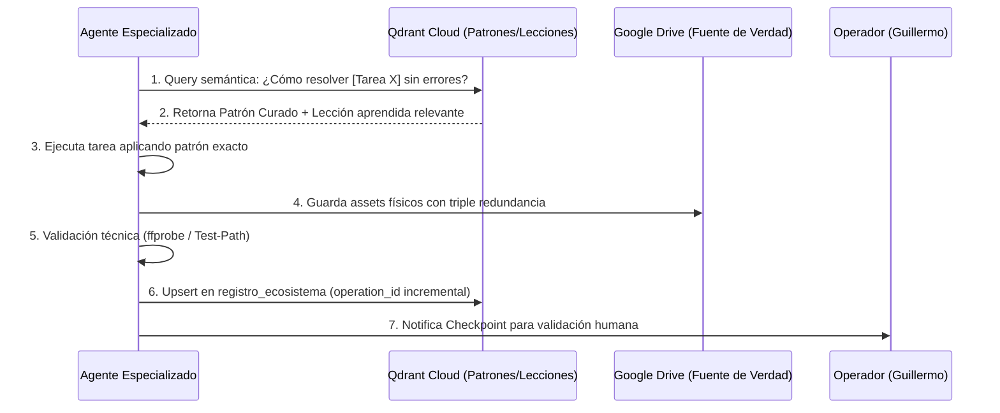

# PLAN MAESTRO: PROMPTS AGÉNTICOS R768 & ORQUESTACIÓN DE VECTORES EN QDRANT
### Ecosistema: HBOS-Diamantino · Arquitectura de Cómputo Soberano
### Arquitecto & Operador: Guillermo Hoyos — Embajador AsertiaNova
### Agente Orquestador: ALEJAVI — Experto en Ecosistema HBOS
### Trazabilidad: Qdrant Cloud (`registro_ecosistema`, `diamantino_agentes`, `diamantino_patrones`, `diamantino_lecciones`)
### Misión: Factoría de Producción Audiovisual Diaria, Determinista y Escalable a Civilización Tipo 5

---

# PARTE 1 — ARQUITECTURA DE PROMPTS AGÉNTICOS CON FACTORIZACIÓN R768

## 1.1. Estructura Estándar de un Prompt R768 (Las 7 Secciones Canónicas)

Todo prompt dentro del ecosistema HBOS-Diamantino debe estructurarse obligatoriamente bajo 7 bloques indivisibles. La ausencia de cualquiera de ellos invalida la ejecución agéntica:

1. **Identidad y Rol:** Definición taxativa del agente (ALEJAVI), su alcance operativo, y el principio soberano: *la creatividad emana del operador (Guillermo Hoyos); el agente ejecuta con rigor formal dentro de límites estrictos*.
2. **Guard Rails Inviolables:** Delimitación de entorno único (`hbos-vector-engine`), aislamiento total respecto a repositorios prohibidos (`openclaw`, `hb-jewelry`), rutas físicas de verdad en Google Drive (`G:\My Drive\HBOS-Diamantino\` y `G:\My Drive\Diamantini\`), y prohibición tajante de cómputo creativo pesado o síntesis de voz local en terminal sin GPU.
3. **Bloque Directivo "Qué Hacer / Qué No Hacer":** Reglas de comportamiento negativo y positivo. Prohibición de alucinación, interpolación de cifras no respaldadas por especificaciones técnicas oficiales (ej. NVIDIA GTC), y la regla de oro: *ante la duda, consultar al operador antes de ejecutar*.
4. **Input del Operador (Tupla Parametrizable):** Declaración formal de variables del episodio (Número, Título, Eje Temático de Silicio/Arquitectura, Duración Objetivo en segundos, Idioma, Personajes activos y `operation_id` inicial).
5. **Factorización Matemática Formal R768:** Ecuación canónica de estado audiovisual:
   $$V(t) = \sum_{i=1}^{M} \left[ N_i \cdot A_i \cdot P_i \cdot E_i \cdot T_i \right]$$
   donde cada plano descompone Narrativa ($N$), Asset ($A$), Personaje/Gema ($P$), Estética ($E$) y Trazabilidad Vectorial ($T$).
6. **DAG en Cascada y Checkpoints Humanos:** Desglose del grafo dirigido acíclico en 4 grupos (A ➔ B ➔ C ➔ D), estableciendo que ningún grupo inicia sin la aprobación humana explícita del hito anterior.
7. **Reglas de Ejecución Global y Cierre:** Protocolo de triple redundancia de guardado físico, verificación programática mediante `ffprobe` / `Test-Path`, y persistencia obligatoria del vector de estado en Qdrant Cloud previo al cierre de sesión.

---

## 1.2. Tipología de Prompts Agénticos

Para garantizar modularidad y reusabilidad sin fuga de tokens, el sistema opera con 5 tipos de prompts especializados:



1. **Prompt Maestro (Root / Factory):** Configura el episodio completo, establece la tupla de parámetros, inicializa el DAG y registra el punto de partida en Qdrant.
2. **Prompt de Fase (Grupo A, B, C, D):** Despliega el contexto específico de la fase (ej. Grupo C: síntesis ElevenLabs y animación Wan 2.1) sin arrastrar metadatos innecesarios de fases anteriores.
3. **Prompt de Tarea Atómica (R769 a R776):** Ejecuta una acción unitaria verificable (ej. R775: síntesis de 7 audios; R776: masterización FFmpeg). Retorna un código de estado binario (ÉXITO / ERROR) y su `operation_id`.
4. **Prompt de Corrección (Feedback Loop):** Se activa cuando un test de verificación (duración, sincronización de audio o tamaño de archivo) falla. Aísla el error, compara contra el patrón curado en Qdrant y re-ejecuta quirúrgicamente sin reiniciar la fase.
5. **Prompt de Recuperación (State Restore):** Se utiliza si el IDE o la terminal se reinicia. Consulta Qdrant por el último `operation_id` completado con éxito y reconstruye el estado en Drive sin duplicar trabajo.

---

## 1.3. Versionado y Ciclo de Vida de Prompts

- **Nomenclatura Semántica:** `_PROMPT_MAESTRO_R768_vX.Y.md`
  - $X$ (Major): Cambios estructurales en el DAG o en la asignación de personajes.
  - $Y$ (Minor): Inclusión de nuevos patrones curados o ajustes de filtros FFmpeg.
- **Histórico Inmutable:** Las versiones anteriores NUNCA se eliminan; residen en `G:\My Drive\HBOS-Diamantino\_MAESTRO\_HISTORICO_PROMPTS\` como memoria evolutiva.
- **Protocolo de Migración:** Una nueva versión solo se promueve a "Estándar Oficial" tras la validación de un episodio piloto completo por parte del operador y su vectorización en `registro_ecosistema`.

---

# PARTE 2 — EMBEDDING DE ORQUESTACIÓN DE VECTORES ENTRE AGENTES

## 2.1. Topología de Colecciones en Qdrant Cloud

El ecosistema se vertebra sobre 6 colecciones vectoriales complementarias en Qdrant Cloud (Cluster GCP `us-east4`):

```
┌────────────────────────────────────────────────────────────────────────┐
│                        QDRANT CLOUD ECOSYSTEM                          │
├────────────────────────────┬───────────────────────────────────────────┤
│ 1. diamantino_assets       │ Catálogo de fotogramas maestros y poses  │
│ 2. diamantino_universo     │ Guiones técnicos, storyboards y lore     │
│ 3. registro_ecosistema     │ Log maestro inmutable de operaciones     │
│ 4. diamantino_agentes      │ Registro y estado de agentes concurrentes│
│ 5. diamantino_patrones     │ Biblioteca de técnicas y filtros curados │
│ 6. diamantino_lecciones    │ Base de conocimiento de fallos y fixes   │
└────────────────────────────┴───────────────────────────────────────────┘
```

---

## 2.2. Espacios de Embeddings por Modalidad (384 Dimensiones)

Para maximizar la interoperabilidad en memoria y habilitar búsqueda cruzada de alta velocidad sin sobrecargar el hardware:

- **Dimensión Universal:** $D = 384$ para todas las colecciones.
- **Métrica de Distancia:** `Distance.COSINE`.
- **Modelos de Proyección:**
  - **Textos, Guiones y Lecciones:** Embeddings semánticos normalizados a 384 dimensiones.
  - **Imágenes y Keyframes:** Embeddings visuales (SigLIP / MobileCLIP 384) alineados con el espacio de texto.
  - **Tareas y DAGs:** Hash semántico ponderado por metadatos (Plano, Duración, Personaje, Frecuencia) mapeado a vector unitario de 384 dimensiones.
  - **Patrones Compuestos:** Vector representativo promediando la firma técnica del código + embedding de la descripción del problema que resuelve.

---

## 2.3. Protocolo de Orquestación e Intercambio Multi-Agente



1. **Consulta Preventiva (Pre-Flight Search):** Antes de generar cualquier asset o script, el agente busca en `diamantino_patrones` y `diamantino_lecciones` si existe una técnica curada previa o un error histórico documentado (evita repetir fallos como el solapamiento de audio o el uso de `-loop 1` estático).
2. **Registro de Salida (Post-Execution Upsert):** Cada output genera un punto con su payload técnico completo (`duracion`, `codecs`, `rutas_redundantes`, `operation_id`).
3. **Desduplicación:** Antes de solicitar inferencias pesadas a APIs de nube, el agente consulta `diamantino_assets` mediante similitud coseno ($> 0.95$) para reutilizar planos o fondos compatibles.

---

# PARTE 3 — CICLO DIARIO DE PRODUCCIÓN AUDIOVISUAL (PIPELINE 24H)

## 3.1. Cronograma de Producción Diaria (1 Episodio / Día)

| Franja Horaria | Hito Operativo | Responsable | Entregables Clave |
|---|---|---|---|
| **08:00 - 09:30** | **Definición & Input:** Declaración del episodio y arquitectura de silicio del día. | Operador (Guillermo) | Tupla YAML de entrada en Prompt Maestro. |
| **09:30 - 11:30** | **GRUPO A (Infraestructura):** Vectorización y selección de variantes en Drive. | Agente ALEJAVI | Checkpoint A aprobado. |
| **11:30 - 13:30** | **GRUPO B (Narrativa):** Redacción de guion técnico oficial y storyboard JSON. | Agente ALEJAVI | `guion_v1.md`, `storyboard_v1.json`, Checkpoint B aprobado. |
| **13:30 - 16:30** | **GRUPO C (Producción Nube):** Síntesis de voz ElevenLabs + Animación real Wan 2.1 I2V. | Agente ALEJAVI (Nube) | Clips `.mp4` con movimiento real, pistas de voz WAV. Checkpoint C aprobado. |
| **16:30 - 18:30** | **GRUPO D (Ensamblado & QA):** Concatenación secuencial, normalización EBU R128 y redundancia triple. | Agente ALEJAVI | `epXX_master_v1.mp4` en 3 rutas, inspección `ffprobe`. |
| **18:30 - 19:00** | **Publicación & Vectorización:** Cierre formal en Qdrant y pase a emisión. | Operador + ALEJAVI | `operation_id` sellado, video en reproducción. |

---

## 3.2. Matriz de Automatización vs. Intervención Humana

| Proceso | Nivel de Automatización | Intervención del Operador |
|---|---|---|
| Generación de Guion y Citas de Hardware | 90% (Generación asistida R768) | Validación de exactitud conceptual técnica. |
| Generación de Fotogramas y Storyboard | 95% (Matriz de prompts) | Selección estética de la pose maestra. |
| Síntesis de Voz IA (ElevenLabs) | 100% Autónomo (API Cloud) | Ninguna (voces y tonos fijos por personaje). |
| Animación I2V (Wan 2.1 Cloud) | 100% Autónomo (DashScope API) | Inspección visual en Checkpoint C. |
| Ensamblado FFmpeg y Triple Redundancia | 100% Autónomo (Scripts certificados) | Verificación de audio/video en reproducción. |
| Aprobación de Checkpoints A, B, C, D | 0% (Estrictamente Manual) | **Aprobación formal de Guillermo Hoyos.** |

---

## 3.3. Cuadro de Mando de Métricas y Rendimiento (SLAs)

- **Duración por Episodio:** $90\text{ s} - 120\text{ s}$ exactos ($\pm 0.1\text{ s}$).
- **Eficiencia de Tokens:** Factorización R768 garantizando $< 15\%$ del consumo de un prompt exhaustivo tradicional (reducción $> 85\%$).
- **Latencia de Render:** Menos de 15 minutos para el ensamble final con FFmpeg local en terminal liviano.
- **Tasa de Error Recurrente Objetivo:** $0\%$ en solapamiento de voces y pérdida de archivos (blindaje por redundancia triple y concatenación lineal de voz).

---

# PARTE 4 — BANCO DE PATRONES CURADOS HBOS

## 4.1. Definición y Ontología de un Patrón Curado

Un **Patrón Curado** es una solución técnica comprobada, determinista y matemáticamente reproducible para un problema específico del pipeline, documentada con código exacto, parámetros probados y vectorizada en Qdrant (`diamantino_patrones`).

---

## 4.2. Registro de Patrones Fundacionales Activos

### Patrón P-01: Animación Real de Personajes (Wan 2.1 I2V Cloud)
- **Problema que resuelve:** Evitar fotogramas estáticos con zoom falso o `-loop 1` de FFmpeg.
- **Implementación:** Invocar API Wan 2.1 (`wan2.1-i2v-turbo` en Alibaba Cloud DashScope / GPU Cloud). Enviar `img_url` pública en Vercel con prompt de cinemática articular. Descargar el clip renderizado de 5.37s y aplicar filtro FFmpeg de extensión temporal con fondo desenfocado 1080p (`boxblur=15:3`, overlay centrado).

### Patrón P-02: Secuenciación Lineal de Audio (Cero Superposición)
- **Problema que resuelve:** Eliminar el solapamiento de voces causado por `amix` multicanal en paralelo y desfases de `adelay`.
- **Implementación:**
  1. Cada actor de voz se sintetiza individualmente.
  2. Todas las pistas de voz se concatenan de forma puramente secuencial en un archivo único [`voiceover_master.wav`](file:///C:/Users/ipane/hbos-deploy/hbos-vector-engine/assets/diamantino/audio/voiceover_master.wav) mediante `-f concat`.
  3. La mezcla final con la música BGM se realiza con un simple `amix=inputs=2:duration=first` (Voz al 100%, Música al 18%-30%). Matemáticamente imposible que dos personajes hablen al mismo tiempo.

### Patrón P-03: Redundancia Triple de Guardado Físico
- **Problema que resuelve:** Pérdida accidental de videos o fallos de sincronización en Google Drive (lección del Ep01).
- **Implementación:** El master renderizado se escribe simultáneamente en 3 destinos:
  1. `05_Master\epXX_master_v1.mp4` (Master oficial)
  2. `06_Publicado\epXX_publicado_v1.mp4` (Copia de emisión)
  3. `_BACKUP_EPISODIOS\{EpXX}_{YYYY-MM-DD}\epXX_master_v1.mp4` (Copia histórica fechada)
  Verificación obligatoria de igualdad en bytes (`Length`) antes de cerrar la tarea.

### Patrón P-04: Masterización Acústica Broadcast EBU R128
- **Problema que resuelve:** Disparidad de volumen entre voces y distorsión por picos.
- **Implementación:** Filtro FFmpeg `-af loudnorm=I=-16:TP=-1.5:LRA=11` aplicado en el render final con contenedor MP4 optimizado vía `-movflags +faststart`.

---

## 4.3. Ciclo de Vida de Nuevos Patrones

```
Descubrimiento de Fallo/Técnica 
  ➔ Resolución Quirúrgica 
  ➔ Prueba de Regresión 
  ➔ Documentación en _PLAN_MAESTRO 
  ➔ Vectorización en `diamantino_patrones`
```

---

# PARTE 5 — GOBERNANZA, ROLES Y CONTROL DE CALIDAD

## 5.1. Jerarquía Operativa y Matriz RACI

```
┌────────────────────────────────────────────────────────────────────────┐
│                        MATRIZ RACI DEL PIPELINE                        │
├──────────────────────┬─────────────┬──────────────┬────────────────────┤
│ Tarea / Fase         │ Guillermo   │ ALEJAVI      │ Agentes Cloud      │
│                      │ (Operador)  │ (Orquestador)│ (Inferencia/Voz)   │
├──────────────────────┼─────────────┼──────────────┼────────────────────┤
│ Definición Tema      │ Responsable │ Consultado   │ Informado          │
│ Guion y Storyboard   │ Aprueba     │ Responsable  │ Consultado         │
│ Generación Clips/Voz │ Consultado  │ Aprueba      │ Responsable        │
│ Ensamble & Redundanc.│ Consultado  │ Responsable  │ Informado          │
│ Emisión Final        │ Aprueba     │ Ejecuta      │ Informado          │
└──────────────────────┴─────────────┴──────────────┴────────────────────┘
```

---

## 5.2. Protocolo Tridimensional de Control de Calidad

Cada episodio se somete a 3 barreras de control antes de declararse oficial:

1. **Barrera Sintáctica (Formatos):**
   - Resolución fija $1920 \times 1080$, framerate $30.00\text{ fps}$, audio estéreo $48\text{ kHz}$.
   - Contenedor MP4 con átomo `moov` al inicio (`+faststart`).
2. **Barrera Semántica (Contenido):**
   - 100% coherencia con la arquitectura GTC Taipei 2026 de Jensen Huang.
   - Cero humanos reales o ficticios; solo entidades minerales antropomórficas 3D.
   - Cero marcas de agua y cero metáforas abstractas sin especificación técnica citable.
3. **Barrera Física (Persistencia):**
   - 3 copias físicas validadas en Google Drive.
   - Vector inmutable persistido en Qdrant Cloud con payload detallado.
