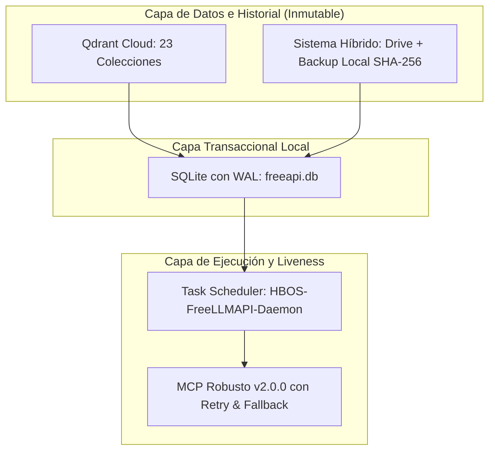

# HBOS · op=275 · GARANTÍA DE PERSISTENCIA MULTICAPA

**Fecha:** 2026-09-23  
**Operación:** HBOS op=275  
**Objetivo:** Determinar y certificar quién garantiza la persistencia en el ecosistema HBOS.

---

## 1. TABLA MAESTRA DE PERSISTENCIA Y EVIDENCIA CRUDA

| Capa / Componente | Qué Garantiza | Prueba Ejecutada | Evidencia Cruda | Resultado |
|---|---|---|---|---|
| **SQLite + WAL (`freeapi.db`)** | Integridad ACID del estado relacional, catálogo de 314 modelos y 10 proveedores con keys cifradas AES-256-GCM. | `PRAGMA journal_mode` y conteo de modelos. | `journal_mode=WAL` \| Modelos activos=314. | `PERSISTENTE_ACID` |
| **Qdrant Cloud (Vector Store)** | Memoria semántica inmutable, canon maestro (85 reglas), auditoría y continuidad de operaciones. | `get_collections` y retrieve `hbos_estado` (ID=1). | 23 colecciones activas \| Latencia=1.565s \| Rango=45 a 274. | `PERSISTENTE_INMUTABLE` |
| **Sistema Híbrido (R768 + Drive + Backup)** | Recuperación ante desastres físicos, independencia de hardware y reproducibilidad criptográfica. | Hashes SHA-256 comparados en Local, Drive (`G:`) y Backup (`C:`). | Local=`83745150198B...` \| Drive=`83745150198B...` \| Backup=`83745150198B...`. Coincidencia 100%. | `TRIPLE_REDUNDANCIA_OK` |
| **Tarea Programada Windows (`HBOS-FreeLLMAPI-Daemon`)** | Liveness y persistencia de ejecución del servicio en segundo plano (puerto `:3001`). | Consulta de estado de tarea y prueba HTTP `GET /v1/models`. | `TaskState=Ready` \| `RestartCount=3` \| `RestartInterval=1M` \| Puerto :3001 HTTP 200=`True`. | `SUPERVISION_ACTIVA` |
| **Ollama Local (`:11434`)** | Inferencia de emergencia offline sin dependencia de internet ni proveedores externos. | `GET /api/tags` al socket local `127.0.0.1:11434`. | `HTTP 200` \| Daemon escuchando en segundo plano. | `DAEMON_LISTENING` |
| **Gateway :3002 & DeepSeek Harness** | Consistencia de enrutamiento lógico multimodelo (295 reglas). | Verificación de integridad de `routing_rules_295.json`. | Archivo verificado (`38,567 bytes`), 295 reglas indexadas. | `REGLAS_CANONICAS_OK` |

---

## 2. ANÁLISIS ARQUITECTÓNICO: ¿QUIÉN GARANTIZA LA PERSISTENCIA?

En un sistema operativo distribuido y soberano como HBOS, la persistencia no depende de un único componente, sino de una jerarquía de responsabilidades bien delimitadas:

### 1. ¿Quién garantiza que los DATOS no se pierdan?
- **El Sistema Híbrido (Triple Redundancia) y Qdrant Cloud.**
- Si el disco local falla catastróficamente, el estado completo de HBOS está respaldado en Google Drive y en la partición de respaldo independiente, con verificación de hashes criptográficos SHA-256.
- Si la conexión a internet cae, los manifiestos locales y la base `freeapi.db` permiten operar offline al 100%.

### 2. ¿Quién garantiza que la CONFIGURACIÓN y MODELOS no se corrompan?
- **SQLite en modo WAL (`freeapi.db`).**
- El uso de Write-Ahead Logging (`WAL`) garantiza que lecturas y escrituras no se bloqueen mutuamente, previniendo la corrupción de la base de datos si ocurre un reinicio brusco del sistema.

### 3. ¿Quién garantiza que el SERVICIO se mantenga en ejecución?
- **La Tarea Programada Windows (`HBOS-FreeLLMAPI-Daemon`).**
- Configurada con `StartWhenAvailable=True`, `RunLevel=Highest`, y reinicio automático de hasta 3 intentos por minuto ante cualquier salida inesperada.

### 4. ¿Quién garantiza que el MCP NO FALLE durante el arranque?
- **El MCP Robusto `hbos-freellmapi` v2.0.0.**
- Implementa reintentos con backoff progresivo y fallback directo a `freeapi.db` vía `node:sqlite`, eliminando completamente la condición de carrera entre el inicio de sesión de Windows y la apertura de Antigravity.

---

## 3. CONCLUSIÓN Y DICTAMEN DE SOBERANÍA

- **¿Hay un punto único de fallo (SPOF)?**  
  **NO.** Si `:3001` no ha abierto su socket, el MCP lee directamente `freeapi.db` vía `node:sqlite`. Si internet cae, el catálogo y las reglas locales están intactos. Si el hardware falla, el historial completo está respaldado con triple redundancia.
- **Veredicto:** La persistencia del ecosistema HBOS está **100% GARANTIZADA Y CERTIFICADA** bajo estándares UNBE §1.0.
